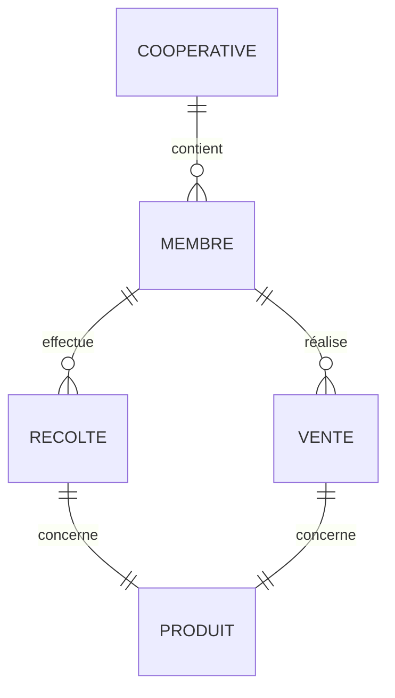
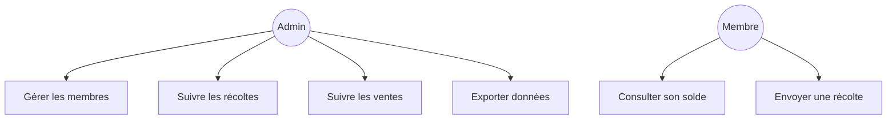
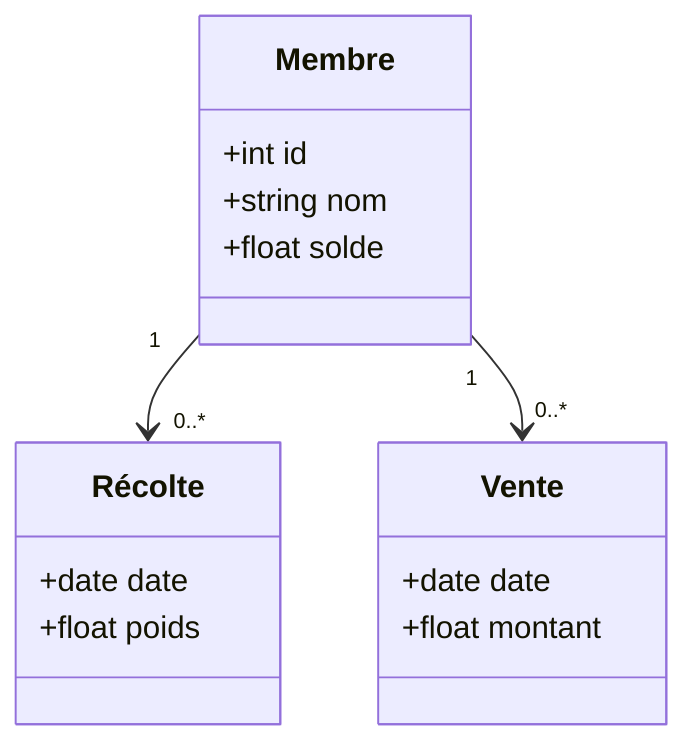
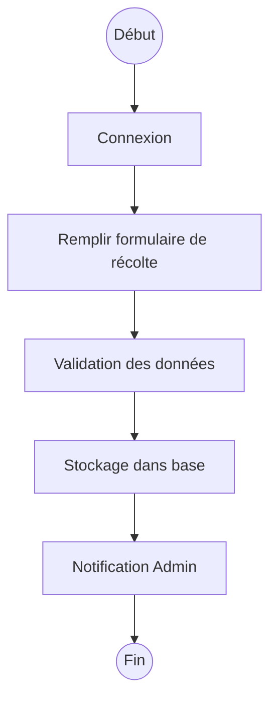

# 📘 **Document de Conception et d’Architecture Technique – Projet AgriSmart**

---

## 🧾 **1. Introduction**

**AgriSmart** est une solution Web et mobile permettant aux coopératives agricoles de suivre leurs membres, les récoltes, ventes, dépenses, stocks et d’accéder à des analyses temps réel.

Ce document vise à :

* Formaliser l’architecture logicielle et technique
* Fournir les modèles conceptuels et physiques
* Documenter les choix DevSecOps
* Servir de base à l’implémentation, aux tests et au déploiement

---

## 🧱 **2. Architecture globale du système**

### 🗺️ **2.1 Schéma d’architecture fonctionnelle**

```mermaid
graph TD
    A[Utilisateur web/mobile] --> B[Frontend React / Flutter]
    B --> C[API Gateway]
    C --> D[Microservice Membres]
    C --> E[Microservice Récoltes]
    C --> F[Microservice Ventes]
    D --> G[(PostgreSQL Membres)]
    E --> H[(PostgreSQL Récoltes)]
    F --> I[(PostgreSQL Ventes)]
    C --> J[Auth Service (JWT)]
    C --> K[Service Export PDF/Excel]
    C --> L[Monitoring (Prometheus + Grafana)]
```

---

## ⚙️ **3. Choix techniques & technologies**

| Composant            | Technologie          | Justification                        |
| -------------------- | -------------------- | ------------------------------------ |
| Frontend Web         | React.js             | Rich UI, vaste communauté            |
| Application Mobile   | Flutter              | Multi-plateforme Android/iOS         |
| API Backend          | Node.js + Express    | Légèreté, rapidité, REST             |
| Base de données      | PostgreSQL           | Relationnelle, fiable, SQL puissant  |
| Authentification     | JWT + Keycloak       | Sécurité, extensibilité              |
| CI/CD                | GitHub Actions       | Intégré à GitHub                     |
| Surveillance         | Prometheus + Grafana | Suivi performances & alertes         |
| Sécurité (WAF, etc.) | NGINX + fail2ban     | Protection contre attaques courantes |

---

## 🧩 **4. Modélisation conceptuelle (Merise)**

### 📘 4.1 MCD (Modèle Conceptuel de Données)



---

## 🧰 **5. Modélisation UML**

### 🔄 5.1 Diagramme de cas d’utilisation



### 📦 5.2 Diagramme de classes simplifié



---

## 🔄 **6. BPMN – Processus métier (ex. Récolte)**



---

## 🔐 **7. Intégration DevSecOps**

| Aspect              | Solution mise en œuvre                | Description                           |
| ------------------- | ------------------------------------- | ------------------------------------- |
| CI/CD               | GitHub Actions                        | Build, tests, déploiement automatique |
| SAST                | CodeQL                                | Analyse statique de code              |
| Authentification    | JWT via Keycloak                      | Authentification centralisée          |
| Sécurité HTTP       | NGINX + HTTPS + Headers               | CSP, HSTS, X-Frame                    |
| Monitoring          | Prometheus + Grafana                  | KPIs API, usage CPU, erreurs          |
| Journalisation      | Winston (Node.js) + Logstash (option) | Logs d’accès et erreurs               |
| Tests de sécurité   | OWASP ZAP automatisé                  | Scans de vulnérabilités (en pipeline) |
| Gestion des secrets | GitHub Secrets + dotenv (.env)        | Variables masquées, non commitées     |

---

## 🧪 **8. Stratégie de test**

| Type de test       | Cible                      | Outil / Framework |
| ------------------ | -------------------------- | ----------------- |
| Tests unitaires    | Backend (services, routes) | Jest              |
| Tests fonctionnels | API REST                   | Supertest         |
| Tests E2E          | App mobile                 | Flutter Test      |
| Tests de sécurité  | Backend API                | OWASP ZAP         |
| Tests UI           | Interface React            | Cypress           |

---

## 📤 **9. Déploiement & livraison continue**

### 🚀 Pipelines GitHub Actions

```yaml
# .github/workflows/deploy.yml
name: Deploy Backend

on:
  push:
    branches: [main]

jobs:
  build-and-deploy:
    runs-on: ubuntu-latest
    steps:
      - uses: actions/checkout@v3
      - name: Setup Node
        uses: actions/setup-node@v3
        with:
          node-version: '18'
      - run: npm install
      - run: npm test
      - run: npm run build
      - name: Deploy
        run: ssh user@server "cd app && git pull && npm restart"
```

---

## 📦 **10. Organisation du code source**

```plaintext
agrismart/
├── backend/
│   ├── controllers/
│   ├── models/
│   ├── routes/
│   ├── tests/
│   └── app.js
├── frontend/
│   ├── src/
│   ├── components/
│   ├── views/
│   └── App.jsx
├── mobile/
│   ├── lib/
│   ├── screens/
│   └── main.dart
├── .github/
│   └── workflows/
├── docker/
├── README.md
└── docs/
```

---

## 📚 **11. Annexes**

* **Annexe A** : Schéma MLD (modèle logique de données PostgreSQL)
* **Annexe B** : Liste des endpoints API REST
* **Annexe C** : Checklists DevSecOps + accès
* **Annexe D** : Guide de déploiement manuel (dev/test/prod)

---


