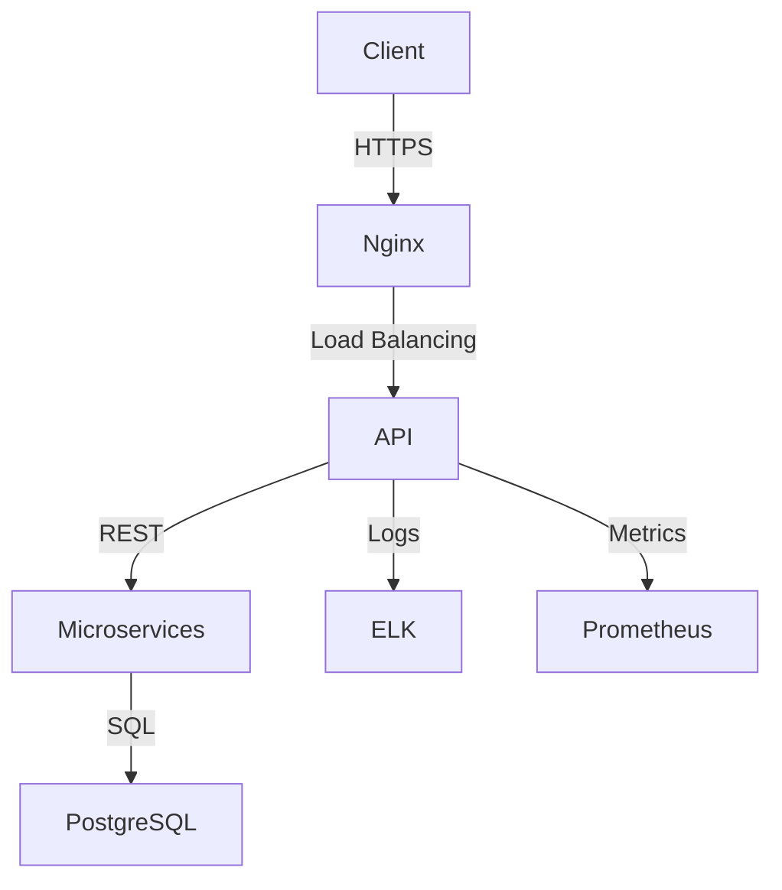
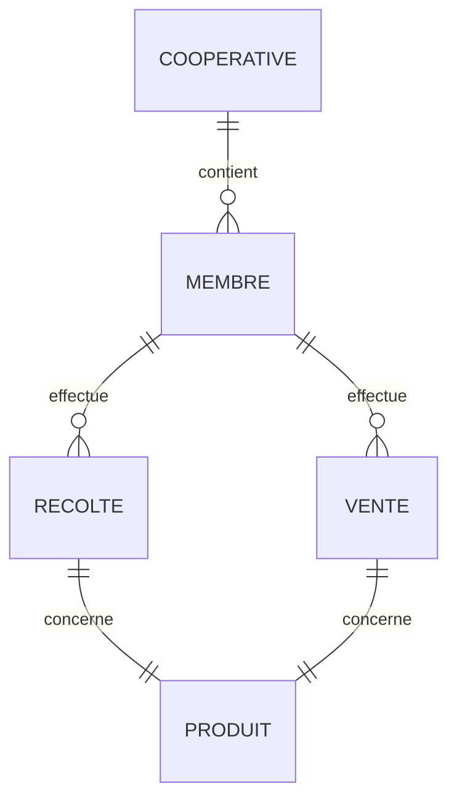
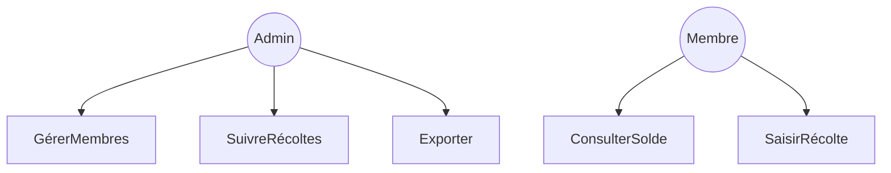
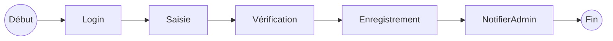
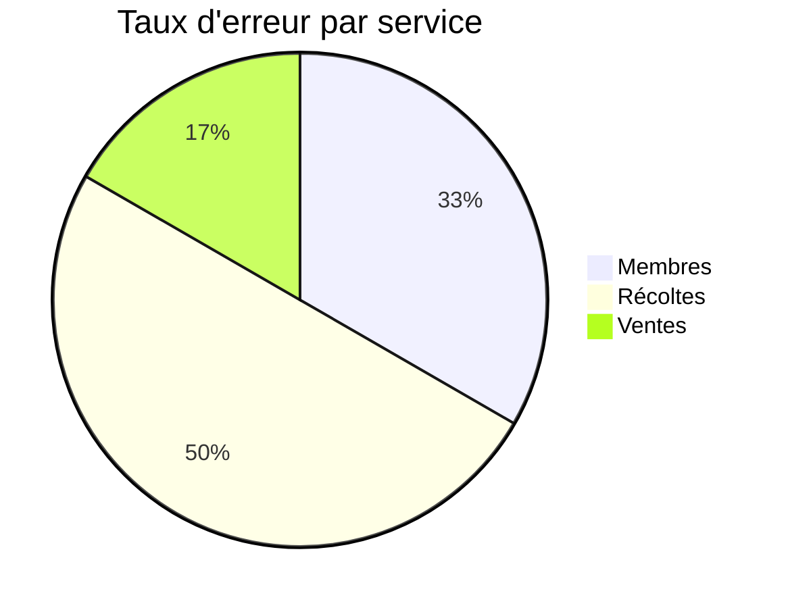

# 📘 Document de Conception et d’Architecture Technique – Projet AgriSmart v1.0

---

## 1. 🎯 Objectif du document

Ce document décrit l’architecture technique, les choix technologiques, la modélisation fonctionnelle et les pratiques DevSecOps mises en place pour le projet **AgriSmart**, une plateforme numérique Web + Mobile de gestion des coopératives agricoles.

---

## 2. 🗺️ Architecture du système

### 2.1 Architecture logicielle – Vue globale

```mermaid
graph TD
    A[Utilisateur web/mobile] --> B[Client React / Flutter]
    B --> C[API Gateway Node.js]
    C --> D1[Service Membres]
    C --> D2[Service Récoltes]
    C --> D3[Service Ventes]
    C --> D4[Service Auth (JWT + Keycloak)]
    C --> D5[Service Export]
    D1 --> DB1[(PostgreSQL Membres)]
    D2 --> DB2[(PostgreSQL Récoltes)]
    D3 --> DB3[(PostgreSQL Ventes)]
    C --> LOGS[Logstash + Elasticsearch]
    C --> MON[Prometheus → Grafana]
```

> Chaque service est déployé sous forme de **microservice conteneurisé** (Docker), orchestré avec **Docker Compose** (ou Kubernetes en version entreprise).

---

## 3. 🧱 Architecture logicielle détaillée (3 couches)

| Couche       | Description                               | Technologies             |
| ------------ | ----------------------------------------- | ------------------------ |
| Présentation | UI Web & Mobile                           | React.js / Flutter       |
| Métier       | Services REST, logique métier             | Node.js / Express        |
| Données      | Bases relationnelles et fichiers exportés | PostgreSQL / Excel / PDF |

---

## 4. ⚙️ Dimensionnement initial & OS

### 4.1 Infrastructure de déploiement cible (MVP)

| Élément                          | Valeur recommandée               |
| -------------------------------- | -------------------------------- |
| Nombre d’utilisateurs simultanés | 100 – 300                        |
| OS Serveur                       | Ubuntu Server 22.04 LTS          |
| RAM (minimum)                    | 8 Go                             |
| CPU                              | 4 vCPU                           |
| Stockage                         | 80 Go SSD                        |
| Réseau                           | 20 Mbps symétrique min           |
| Environnement                    | Cloud VPS (Scaleway / OVH / AWS) |

### 4.2 Répartition recommandée



---

## 5. 🗃️ Modélisation Merise & UML

### 5.1 MCD (Modèle conceptuel de données)



### 5.2 UML – Cas d’utilisation



### 5.3 BPMN – Saisie de Récolte



---

## 6. 🧪 Tests et qualité logicielle

| Type de test        | Objectif                     | Outils                 |
| ------------------- | ---------------------------- | ---------------------- |
| Tests unitaires     | Fonctions & services         | Jest                   |
| Tests d’intégration | API REST + base de données   | Supertest + PostgreSQL |
| Tests E2E           | Scénarios complets UI        | Cypress / Flutter test |
| Tests sécurité      | Vulnérabilités connues OWASP | OWASP ZAP              |

---

## 7. 🔐 Intégration DevSecOps

### 7.1 Sécurité

| Cible               | Mesure mise en place                      |
| ------------------- | ----------------------------------------- |
| Authentification    | JWT + Keycloak                            |
| Sécurité API        | Rate limiting, validation, CORS           |
| Transport HTTPS     | Let’s Encrypt + HSTS + CSP                |
| Secrets & Tokens    | `.env` + GitHub Secrets + Vault optionnel |
| Analyse code (SAST) | GitHub CodeQL                             |

### 7.2 CI/CD

```yaml
# GitHub Actions simplifié
name: CI/CD Backend
on:
  push:
    branches: [main]
jobs:
  build:
    runs-on: ubuntu-latest
    steps:
      - uses: actions/checkout@v3
      - run: npm install && npm test && npm run build
```

---

## 8. 🔭 Supervision & Observabilité

| Élément surveillé     | Outil                     | Détail                         |
| --------------------- | ------------------------- | ------------------------------ |
| Logs applicatifs      | Logstash + Elasticsearch  | Centralisation des logs        |
| KPIs & métriques      | Prometheus + Grafana      | Erreurs, latence, usage CPU    |
| Alertes               | Alertmanager              | Emails + Slack en cas de pic   |
| Health check services | NGINX + UptimeRobot       | Surveillance HTTP / HTTPS      |
| Traces API            | OpenTelemetry (optionnel) | Debug & traçabilité des appels |

### Extrait de dashboard Grafana



---

## 9. 📦 Organisation des répertoires

```bash
agrismart/
├── backend/
│   ├── controllers/
│   ├── routes/
│   ├── services/
│   ├── tests/
│   └── app.js
├── frontend/
│   ├── src/
│   └── components/
├── mobile/
│   └── lib/
├── infra/
│   ├── docker-compose.yml
│   └── nginx.conf
├── .github/workflows/
├── monitoring/
│   ├── prometheus.yml
│   ├── grafana/
│   └── alert.rules
└── README.md
```

---

## 🔚 10. Conclusion

Ce document est un **référentiel technique unique** :

* Pour les développeurs (base de code, API, sécurité)
* Pour les DevOps (CI/CD, dimensionnement, supervision)
* Pour les décideurs (vision système, architecture logicielle)

Il est mis à jour à chaque **changement majeur de conception**, et validé à chaque **release**.

---


